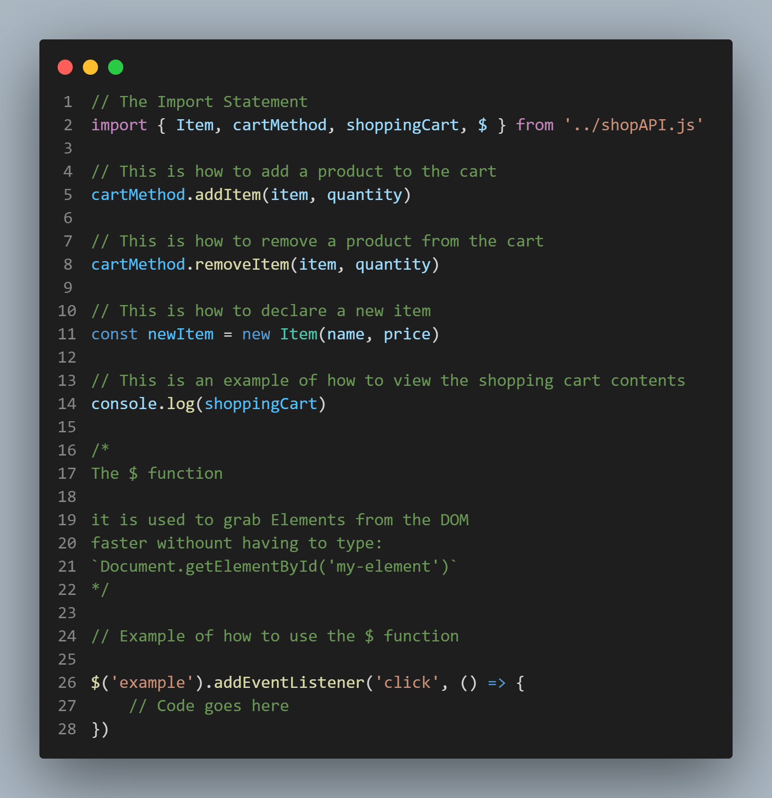

# Ștefan Store API

### How To use the Ștefan Store API:
Use the image for reference

### How to add to a project:

1. Download from GitHub
2. You only have to import the shopAPI.js file into your JavaScript/TypeScript project
3. Import everything into your JavaScript/TypeScript project (use the image above for reference)

That is all there is.

### Disclaimer

The API is not complete, it is something that I will use in a future project of mine so for now, I uploaded this to keep it safe and maybe it might interest some of you. More features coming in the future!